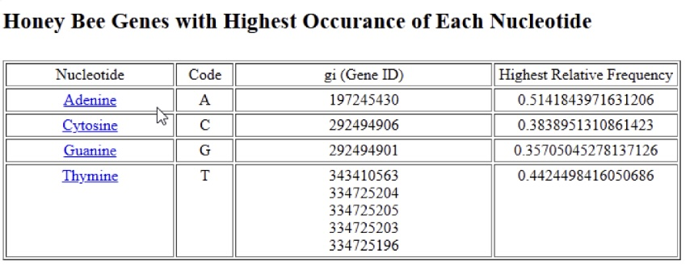
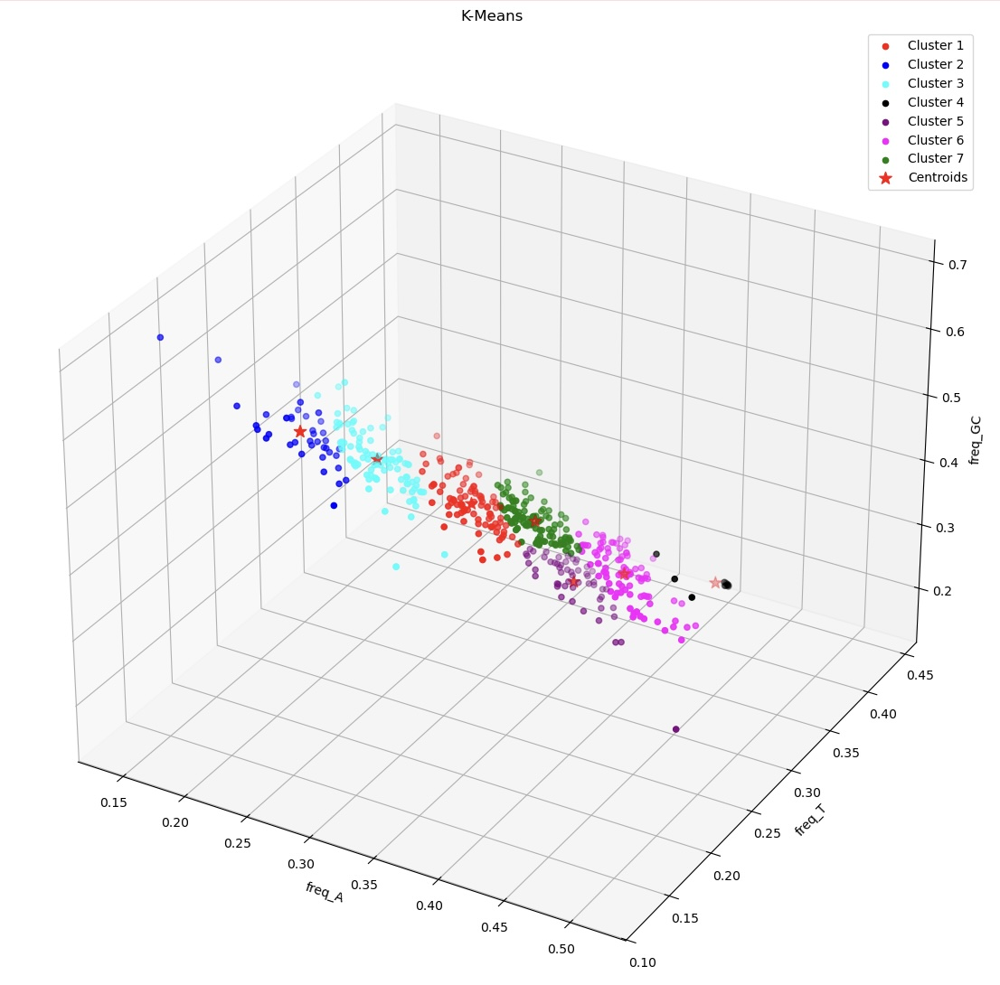

# Honeybee Gene Sequence Integration & Analysis
A Full-Stack Bioinformatics Pipeline: CGI, Oracle SQL, and K-Means Clustering

## Problem Statement
Analyzing genomic data requires more than just biological knowledge; it requires a robust pipeline to store, retrieve, and interpret complex sequences. This project focuses on the Honeybee (Apis mellifera) genome. The goal is to build a web-based system that allows users to upload raw gene sequences, calculate their nucleotide frequencies (specifically the GC-content, which is a key biological indicator), and use K-Means Clustering to identify patterns within the genomic data.

## Methodology
The project is architected as a complete data lifecycle:
(1) Data Ingestion: Developing a web interface to handle raw .txt files from NCBI.

(2) String Manipulation: Implementing a custom "gene-start" marker logic to handle inconsistent genomic formatting in the raw data.

(3) Database Engineering: Designing a schema in Oracle to handle variable-length gene sequences and their associated statistical frequencies.

(4) Pattern Recognition: Using the extracted frequencies to cluster genes into 7 distinct groups based on their chemical compositions (A, T, and GC).

In particular:
- Web Tier: HTML (KompoZer) and Python-based CGI (Common Gateway Interface) for server-side processing.
- Database Tier: Oracle Database integrated via cx_Oracle. Utilized Bind Variables and Batch Writing for efficient high-volume data insertion.
- Bioinformatics: Custom Python logic to calculate relative frequencies of Adenine (A), Cytosine (C), Guanine (G), and Thymine (T).
- Analytics Tier: Jupyter Notebook using NumPy for data arrays, Scikit-learn for K-Means Clustering, and Matplotlib for 3D visualization.

## Dataset Overview
- Source: NCBI Honeybee Gene Sequences.
- Features Extracted: GI number, full nucleotide sequence, and individual/combined frequencies ($A, C, G, T, \text{and } GC$).
- Key Constraint: Determined the maximum nucleotide length across all entries to prevent data truncation in the Oracle VARCHAR2/CLOB fields.

## Results & Key Findings
(1) Successful Integration: Developed a dynamic system where CGI scripts automatically parse raw genomic text and populate an Oracle table (beeGenes) with 7 distinct columns of data.

(2) Database Confirmation: Verified data integrity by retrieving the final entry in the dataset (GI: 147907436) via a dedicated Python query script.

(3) Clustering Analysis: Executed a 7-cluster K-Means analysis in a 3D space (freq\_A, freq\_T, freq\_GC).
- Parameters: 500 max iterations with a tolerance of 1e-4.
- Visualization: Produced a 14 x 14 3D scatter plot with color-coded clusters and marked centroids, revealing distinct "genomic signatures" among the bee genes.

## Discussion
- Biological Meaning: The use of $GC$ frequency as a clustering variable is significant because $GC$ pairs have three hydrogen bonds (compared to two for $AT$), affecting the stability and "melting temperature" of the DNA.
- Technical Scalability: By using Batch Writing and Bind Variables, the system is designed to handle significantly larger genomic datasets without a linear increase in database overhead.

## Acknowledgement
- This project was completed as the final-semester project for STSCI 4060: Python Programming and Its Application in Statistics by Professor Xiaolong Yang.
- This project was awarded 100% for its successful execution, data processing and retrieval, machine learning and visualization.
- To replicate the results, please refer to the file [instruction.md](instruction.md) in the directory.
- To cross-check the results, please refer to the file [Project_Report.pdf](Project_Report.pdf) in the directory.

